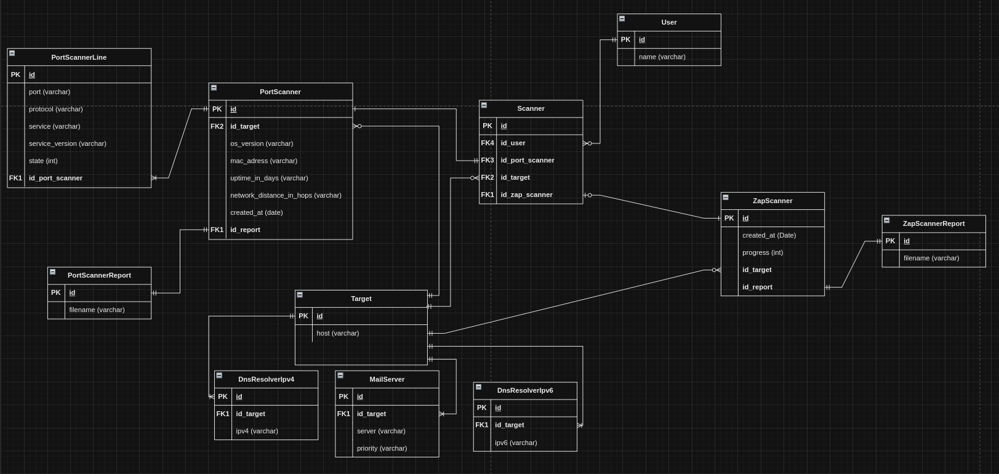

# Audit Tool


## Getting started

This guide outlines the steps to set up and launch the project on Windows, macOS, and Linux.

## Prerequisites
Make sure you have the following installed:

- [Python 3.x](https://www.python.org/downloads/): Verify by running `python3 --version` in your terminal.
- [Docker](https://docs.docker.com/get-docker/): Install Docker according to your operating system.


## Steps
### 1. Create a Project Directory:

- Open your terminal or command prompt.

- Navigate to your desired project location.

- Create a new directory for your project

- Create a 'src' folder at the root level of your project. This folder will house the source code of your project.

- Make sure both the source code directory and the virtualenv directory are situated at the same level.

Additionally, for your convenience, there's an exportation file available for a Postman collection named 'Security Audit.postman_collection.json'. You can utilize it to streamline testing and ensure comprehensive security assessment.


### 2. Set Up a Virtual Environment
**Windows**
```
python -m venv venv
venv\Scripts\activate
```

**macOS/Linux**
```
python3 -m venv venv
source venv/bin/activate
```


### 3. Install Django and Dependencies:
Once your virtual environment is activated, install Django and any required dependencies using pip

```
pip install -r requirements.txt
```

### 4. Create a Superuser
This user will be used to access the admin panel by navigating to "localhost:8000/admin".
```
python manage.py createsuperuser
```

### 5. Security Scanning with ZAP as a container
```
docker run -u zap -p 8091:8091 -i softwaresecurityproject/zap-stable zap-x.sh -daemon -host 0.0.0.0 -port 8091 -config api.addrs.addr.name=.* -config api.addrs.addr.regex=true -config api.key=mohamed
```

### 6. Create .env file
Create a .env file in the root directory of your project with the following content:

```
DJANGO_ENV="DEV"
DJANGO_LOG_LEVEL="INFO"
ZAP_DOCKER_API_KEY="mohamed"
ZAP_HTTP_PROXY="http://127.0.0.1:8091"
ZAP_HTTPS_PROXY="http://127.0.0.1:8091"
```

### 7. Start the project
To start the project, execute the shell script named entrypoint.sh located in the src directory.
```
./entrypoint.sh
```
## Architectures
### Database



## Core Components

### Main Application

The main application serves as the core of the project, handling general functionalities and routing.

### Information-Gathering Application

The information-gathering application specializes in network scanning using tools like Nmap to gather essential data about network configurations and devices.

### Enumeration

The enumeration component integrates the OWASP ZAP scanner into the application, enabling comprehensive security testing and vulnerability scanning.

### Logs and Reports

- **Logs Folder:** Contains all application logs.
- **Logs Configuration:** Log configuration settings are defined in the settings file for easy management and customization.
- **Reports Folder:** Stores all reports generated by the application, providing insights into security assessments and network scans.


